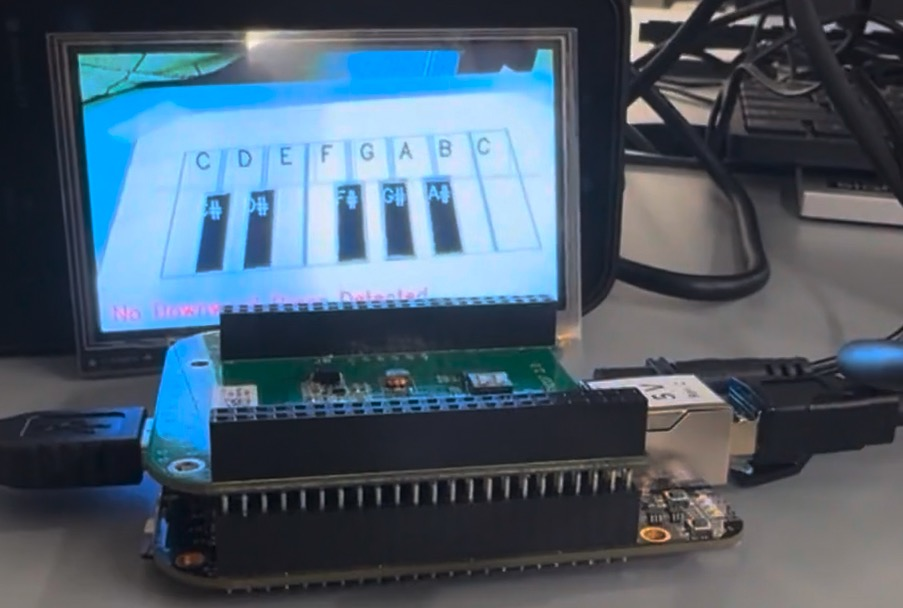

# PianoVision


PianoVision is a vision-based embedded system designed to detect piano key interactions in real time using a BeagleBone Black client and a Streamlit-based server. The project integrates camera input, OpenCV-based processing, and network communication to enable interactive piano key recognition and visualization.

[[Demo Video]](https://drive.google.com/file/d/1-rKcJ6C8kJhrGO2AKs04Ngn3e70F9SeW/view?usp=sharing)

---

## Contents:
1. Description  
2. Image and OS Setup  
3. Installation Requirements and Steps  
4. Compilation and Execution  
5. Initial Calibration  
6. Contact  

---

## 1. Description
PianoVision consists of two main components:
- **Client** running on a BeagleBone Black that captures camera frames and performs image processing using OpenCV.
- **Server** running on a host machine that provides a web-based interface using Streamlit for visualization and interaction.

The system enables real-time detection of piano key presses after an initial calibration step.

---

## 2. Image and OS Setup
We use the **Debian IoT (non-graphical) image** for the BeagleBone Black, available here:  
[Debian IoT Image for BeagleBone Black](https://www.beagleboard.org/distros/beaglebone-black-debian-12-12-2025-10-29-iot-v5-10-t)

---

## 3. Installation Requirements and Steps

### PianoVision Client – Initial Setup
1. Manually assign a local IP address to the host system’s ethernet interface  
   (used: `192.168.137.1`).
2. SSH into the BeagleBone:  `ssh debian@BeagleBone`. Change the password when prompted.
3. Share the host system’s internet connection (WiFi) to the ethernet interface so the BeagleBone can access the internet.

---

### Installation of Packages on the BeagleBone Black
Perform the following steps on the **BeagleBone Black**.

#### Install GStreamer
```
sudo apt-get install gstreamer1.0-tools gstreamer1.0-plugins-good gstreamer1.0-plugins-bad
```

Test if camera input and LCD output::
```
gst-launch-1.0 v4l2src device=/dev/video0 ! video/x-raw,width=640,height=480 ! videoconvert ! videoscale ! video/x-raw,width=480,height=272 ! fbdevsink device=/dev/fb0
```

#### Install OpenCV
```
sudo apt-get install libopencv-dev python3-opencv
```

---
## 4. Compilation and Execution
### Compilation of PianoVision Client
Compilation is performed **directly on the BeagleBone Black** (no cross-compilation required):

```
g++ main.cpp network.h network.cpp cv.h cv.cpp config.h config.cpp -o exec_final `pkg-config --cflags --libs opencv4`
```

### Environment Setup of PianoVision Server
The PianoVision server runs a web application using **Streamlit**.

**Required dependencies:**
```
streamlit==1.51.0
numpy==2.2.6
PyAudio==0.2.14
opencv-contrib-python==4.12.0.88
opencv-python==4.12.0.88
```

**Run the PianoVision Server**
```
streamlit run server.py
```
---

## 5. Initial Calibration
1. Using `gstreamer`, capture a frame from the camera.
2. Transfer the captured image to the host machine using `scp`.
3. Run the calibration script: `python calibration.py`
4. Select **6 points**:
   - Four corner points
   - Corners of two white piano keys

Example calibration output:
```
19 160
424 158
394 34
53 33
183 32
221 32
```

5. Copy these values into the `calibration_values.txt` file on the BeagleBone Black.

---

## 6. Contact
For questions or further information about the project, please feel free to reach out.